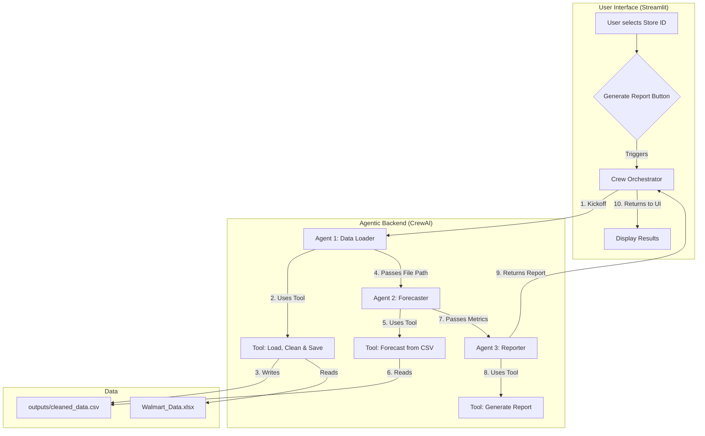

# Foresight-Agents: AI-Powered Walmart Sales Forecasting

Foresight-Agents is a sophisticated, multi-agent AI system designed to automate the complex workflow of retail sales forecasting. This project leverages CrewAI to orchestrate specialized agents that handle data ingestion, time-series modeling with Prophet, and the generation of executive-level business reports. The entire pipeline is exposed through a user-friendly web interface built with Streamlit.

![Streamlit App Screenshot]


---

## ✨ Features

- **Multi-Agent System:** Utilizes CrewAI to create a team of specialized AI agents (Data Loader, Forecaster, Reporter) that collaborate to perform a complex task.
- **Automated Time-Series Forecasting:** Employs Facebook's Prophet model to generate a 52-week sales forecast, incorporating holidays and external macroeconomic regressors like CPI and fuel prices.
- **Dynamic Report Generation:** The final agent uses a powerful LLM (GPT-4o) to synthesize model outputs into an insightful, human-readable executive summary with actionable recommendations.
- **Interactive Web Interface:** A simple and clean UI built with Streamlit allows non-technical users to select a store and generate a forecast report with a single click.
- **Robust Data Handling:** Implements a filesystem-based handoff between agents to ensure reliable transfer of data (e.g., cleaned datasets) throughout the workflow.

---

## 🏛️ Architecture

The system is built on a three-agent crew, where each agent has a distinct role and set of tools. The workflow is sequential, with the output of one agent serving as the context for the next.


---

## 🛠️ Tech Stack

- **Core Framework:** Python 3.12
- **Agent Framework:** [CrewAI](https://www.crewai.com/)
- **LLM Integration:** [LangChain](https://www.langchain.com/), [OpenAI](https://openai.com/)
- **Time-Series Modeling:** [Prophet](https://facebook.github.io/prophet/)
- **Data Manipulation:** [Pandas](https://pandas.pydata.org/)
- **Web Interface:** [Streamlit](https://streamlit.io/)
- **Configuration:** PyYAML

---

## 🚀 Setup and Installation

Follow these steps to set up and run the project locally.

**1. Clone the repository:**
```bash
git clone [https://github.com/neelabhpant/Foresight-Agents.git](https://github.com/neelabhpant/Foresight-Agents.git)
cd Foresight-Agents
```

**2. Create and activate a Python virtual environment:**
```bash
# For macOS/Linux
python3 -m venv venv
source venv/bin/activate

# For Windows
python -m venv venv
.\venv\Scripts\activate
```

**3. Install the dependencies:**
This project uses a `requirements.txt` file to manage its dependencies.
```bash
pip install -r requirements.txt
```

**4. Set up your environment variables:**
Create a file named `.env` in the root of the project directory. **This file should not be committed to Git.**
```
OPENAI_API_KEY="your_openai_api_key_here"
```
Replace `your_openai_api_key_here` with your actual OpenAI API key.

---

## 🏃‍♀️ Usage

Once the setup is complete, you can launch the Streamlit application.

**1. Run the app:**
Ensure you are in the root `Foresight-Agents` directory and your virtual environment is active. Then, run:
```bash
streamlit run app.py
```

**2. Use the application:**
Your web browser will open to the application's URL.
- Select a Walmart store ID from the dropdown menu.
- Click the "Generate Forecast Report" button.
- Wait for the agent crew to complete the analysis and generate the report.

---

## 📁 Project Structure

```
FORESIGHT_AGENTS/
├── .env                  # For secret keys (NOT committed)
├── .gitignore            # Specifies files for Git to ignore
├── app.py                # The main Streamlit application file
├── requirements.txt      # Project dependencies
├── config/
│   └── models.yaml       # LLM configuration
├── crew/
│   ├── agents.py         # Defines the three specialized agents
│   ├── main.py           # Assembles and runs the Crew
│   └── tasks.py          # Defines the tasks for each agent
├── data/
│   └── Walmart_Sales.xlsx # The raw input data
└── tools/
    ├── data_tools.py     # Tool for loading and cleaning data
    ├── model_tools.py    # Tool for forecasting and evaluation
    └── report_tools.py   # Tool for generating the final report
```
